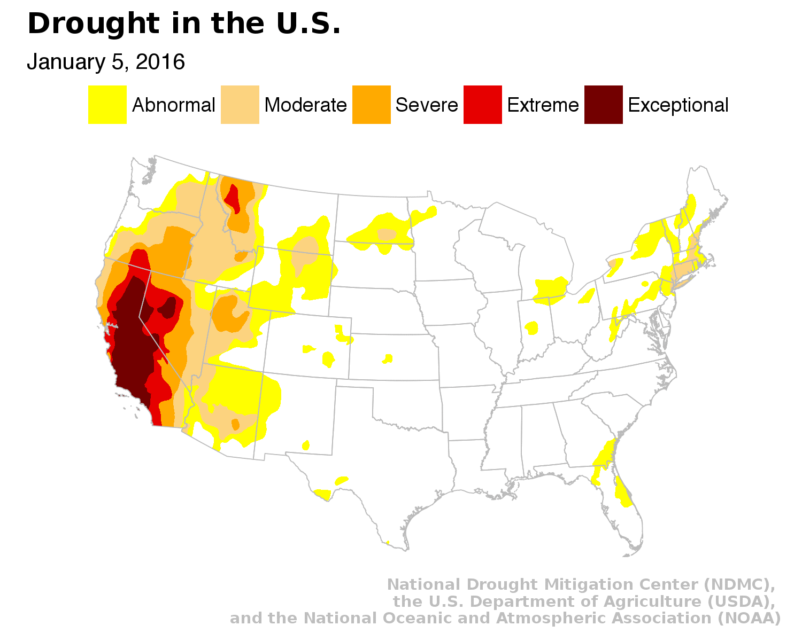
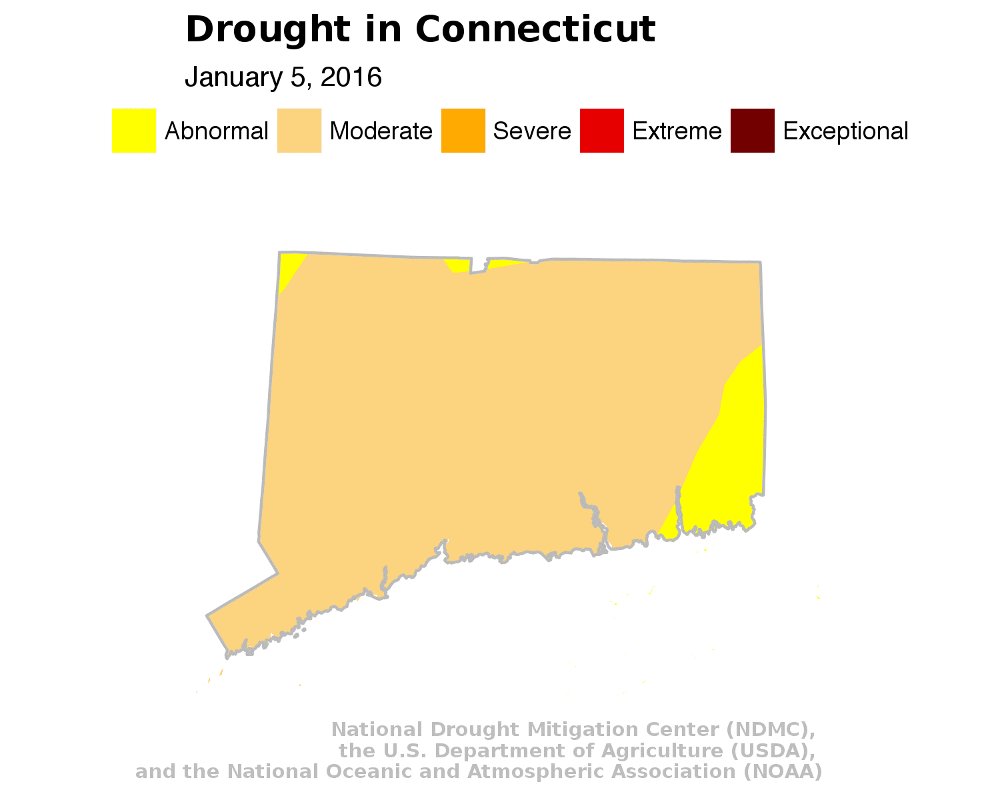

This repository contains source shapefiles and visualization scripts for the Trend CT story: [How the drought has spread in Connecticut](http://trendct.org/2016/10/11/how-the-drought-has-spread-in-connecticut/) .

What's in this walkthrough:

* Generating individual visualizations of the severity of droughts in 2016
* Generating GIFs using the individual visualizations
* For both U.S. and CT

## Loading libraries
```{r setup, message=F, warning=F, quietly=TRUE}
library(tidyr)
library(dplyr)
library(ggmap)
library(ggplot2)
library(rgdal)
library(sp)
library(maptools)
library(scales)
library(extrafont)
library(lubridate)
library(magick)
```

## Prepping the shape files
```{r loading, message=F, warning=F, quietly=TRUE}
# Bring in the base layer of US state borders
usmap <- readOGR(dsn="us_shape", layer="statesp010g")

# Convert the shapefile into a dataframe that we can work with
usfort <- fortify(usmap, region="STATE_ABBR")

# NOTE: YOU CAN CREATE STATE-SPECIFIC MAPS FOR YOUR STATE IF YOU SUB OUT "CT" 
# AND THEN CHANGE THE BOUNDING BOX LATITUDES AND LONGITUDES (XLIM AND YLIM IN COORD_MAP)
# IN THE CONNECTICUT CHUNK OF CODE BELOW

# Creating a shapefile specifically for Connecticut
ctfort <- filter(usfort, id=="CT")

# Creating a shapefile of all state shapes minus Connecticut
not_ct_fort <- filter(usfort, id!="CT")

# Compiling a list of the folders in the 'shapes' folder
shape_list <- list.files("shapes")
```

## United States

```{r us, fig.width=9, fig.height=5, warning=F, message=F, quietly=TRUE}
for (i in 1:length(shape_list)) {
  
  # Loop through and gets the folder name
  file_name <- shape_list[i]
  
  # Figures out the exact folder location
  dsn_name <- paste0("shapes/", file_name)
  
  # The shapefile itself is the same as the directory minus "_M"
  layer_name <- gsub("_M", "", file_name)
  
  # The shapefiles/directories are labeled by date, so we want to extract that and turn it into a string (AP format)
  the_date <- gsub("USDM_", "", layer_name)
  the_date <- ymd(the_date)
  ap_date <- paste0(month(the_date, label=T, abbr=F), " ", day(the_date), ", ", year(the_date))
  
  # Now that we've got the name of the shapefile and the folder location, we can read in the data
  droughtmap <- readOGR(dsn=dsn_name, layer=layer_name)
  
  # Transform the shapefile into a dataframe so we can work with it in R
  droughtfort <- fortify(droughtmap, region="DM")
  
  gg <- ggplot() 
  
  # This line will bring in the drought shapefile
  gg <- gg +  geom_polygon(data = droughtfort, aes(x=long, y=lat, group=group, fill=id), color = "black", size=0) 
  
  # This line brings in the US borders as a layer
  gg <- gg +  geom_polygon(data = usfort, aes(x=long, y=lat, group=group, fill=total), color = "gray73", fill=NA, size=0.2) 
  
  # This sets the boundaries of the view so it excludes Alaska and Hawaii
  gg <- gg +  coord_map("polyconic", xlim=c(-125, -70), ylim=c(25.5, 48.5)) 
  
  # This line sets the colors and text for the legend items
  gg <- gg +  scale_fill_manual(name="", values = c("#FFFF00", "#FCD37F", "#FFAA00", "#E60000", "#730000"),
                                labels = c("Abnormal", "Moderate", "Severe", "Extreme", "Exceptional"))
  
  # The rest of the code in this chunk is for blurbs and style.
  gg <- gg + labs(x=NULL, y=NULL, 
                  title="Drought in the U.S.",
                  subtitle=ap_date,
                  caption="National Drought Mitigation Center (NDMC), \nthe U.S. Department of Agriculture (USDA), \n and the National Oceanic and Atmospheric Association (NOAA)")
  gg <- gg + theme(plot.title=element_text(face="bold", family="Lato Regular", size=13))
  gg <- gg + theme(plot.caption=element_text(face="bold", family="Lato Regular", size=7, color="gray", margin=margin(t=10, r=80)))
  gg <- gg + theme(legend.position="top")
  gg <- gg + theme(axis.line =  element_blank(),
                   axis.text =  element_blank(),
                   axis.ticks =  element_blank(),
                   panel.grid.major = element_blank(),
                   panel.grid.minor = element_blank(),
                   panel.border = element_blank(),
                   panel.background = element_blank()) 
print(gg)
}
```

# U.S. GIF

```{r us_gif, fig.width=9, fig.height=5, warning=F, message=F, quietly=TRUE}
# Creates a list of the images in us_maps_gif
the_list <- paste0("us_maps_gif/", list.files("us_maps_gif/"))

# This function applies the function image_read to the files in the_list
frames <- lapply(the_list, image_read)

# This creates a gif of the frames
animation <- image_animate(image_join(frames), fps=4)

# Saves image
image_write(animation,"us_map.gif")

# Loading image
```


----

## Connecticut

```{r ct, fig.width=9, fig.height=5, warning=F, message=F, quietly=TRUE}


for (i in 1:length(shape_list)) {
  
  # Loop through and gets the folder name
  file_name <- shape_list[i]
  
  # Figures out the exact folder location
  dsn_name <- paste0("shapes/", file_name)
  
  # The shapefile itself is the same as the directory minus "_M"
  layer_name <- gsub("_M", "", file_name)
  
  # The shapefiles/directories are labeled by date, so we want to extract that and turn it into a string (AP format)
  the_date <- gsub("USDM_", "", layer_name)
  the_date <- ymd(the_date)
  ap_date <- paste0(month(the_date, label=T, abbr=F), " ", day(the_date), ", ", year(the_date))
  
  # Now that we've got the name of the shapefile and the folder location, we can read in the data
  droughtmap <- readOGR(dsn=dsn_name, layer=layer_name)
  
  # Transform the shapefile into a dataframe so we can work with it in R
  droughtfort <- fortify(droughtmap, region="DM")
  
  # Same as annotations above except where noted
  gg <- ggplot() 
  gg <- gg +  geom_polygon(data = droughtfort, aes(x=long, y=lat, group=group, fill=id), color = NA, size=0.5) 
  
  # Adds a layer that whites out all states minus Connecticut so it covers the drought layer in all areas except Connecticut
  gg <- gg +  geom_polygon(data = not_ct_fort, aes(x=long, y=lat, group=group, fill=total), color = "white", fill="white", size=.5) 
  
  # Adds a layer for Connecticut so it adds a black border for clarity
  gg <- gg +  geom_polygon(data = ctfort, aes(x=long, y=lat, group=group, fill=total), color = "gray73", fill=NA, size=0.5) 
  
  # This is the bounding box so it sets the viewpoint to just Connecticut
  # Change this bounding box below if you want to set it anywhere else
  gg <- gg +  coord_map("polyconic", xlim=c(-73.8, -71.6), ylim=c(40.9, 42.2)) 
  gg <- gg +  scale_fill_manual(name="", values = c("#FFFF00", "#FCD37F", "#FFAA00", "#E60000", "#730000"),
                                labels = c("Abnormal", "Moderate", "Severe", "Extreme", "Exceptional"))
  gg <- gg + labs(x=NULL, y=NULL, 
                  title="Drought in Connecticut",
                  subtitle=ap_date,
                  caption="National Drought Mitigation Center (NDMC), \nthe U.S. Department of Agriculture (USDA), \n and the National Oceanic and Atmospheric Association (NOAA)")
  gg <- gg + theme(plot.title=element_text(face="bold", family="Lato Regular", size=13))
  gg <- gg + theme(plot.caption=element_text(face="bold", family="Lato Regular", size=7, color="gray", margin=margin(t=10, r=80)))
  gg <- gg + theme(legend.position="top")
  gg <- gg + theme(axis.line =  element_blank(),
                   axis.text =  element_blank(),
                   axis.ticks =  element_blank(),
                   panel.grid.major = element_blank(),
                   panel.grid.minor = element_blank(),
                   panel.border = element_blank(),
                   panel.background = element_blank()) 
print(gg)
}
```

# CT GIF

```{r ct_gif, fig.width=9, fig.height=5, warning=F, message=F, quietly=TRUE}
# Same code as above but just for a different folder this time
the_list <- paste0("ct_maps_gif/", list.files("ct_maps_gif/"))
frames <- lapply(the_list, image_read)
animation <- image_animate(image_join(frames), fps=4)
image_write(animation,"ct_map.gif")
```

